# Data flow

Notebook paths below are relative to [partners/](partners/), except ⑨ which is relative to
this folder. Each partner owns a subfolder holding its notebooks, its extracted library, its
tests and its data files.

```mermaid
flowchart TB
    classDef rawFile fill:#d4e6f1,stroke:#2980b9,color:#000
    classDef cleanedFile fill:#d5f5e3,stroke:#27ae60,color:#000
    classDef finalFile fill:#a9dfbf,stroke:#1e8449,color:#000
    classDef campaignFile fill:#fdebd0,stroke:#e67e22,color:#000
    classDef sharedInput fill:#e8daef,stroke:#8e44ad,color:#000

    RGPD_LIST[("RGPD emails\nexclusion list")]:::sharedInput
    EXISTING_CODES[("Existing codes\n2026")]:::sharedInput

    CNAF_RAW[("CNAF_PATHFILE_2026\nCSV / ASCII / sep=;")]:::rawFile
    MSA_RAW[("MSA_PATHFILE_2026\nExcel")]:::rawFile
    CNOUS_RAWS[("CNOUS raw files\nCSV / UTF-8 / sep=,")]:::rawFile
    FSS_RAW[("FSS_PATHFILE_2026\nCSV / UTF-8 / sep=;")]:::rawFile

    subgraph CNAF_NB1["①a cnaf/clean_cnaf_1_before_qf_batch.ipynb"]
        c1["Load CSV · drop last row\nstrip whitespace\nextract postal + commune from ADRLIG5"]
        c2["Map columns → PSP schema · organisme='CAF'\nsituation = CNAF's own ORIGINESELECTION\n(AAH/ARS→jeune/AEEH), no more DOB+name guessing"]
        c2b["Dedup ARS rows by allocataire (1 quotient_familial\ncall per household, not per child) → qf-batch input CSV"]
        c3["Remove rows missing nom/prenom/dob/genre\nRGPD email filter · age > 30 filter\nfix phone numbers · drop duplicates"]
        c4["Serialize allocataire + adresse_allocataire → JSON"]
        c1-->c2-->c2b-->c3-->c4
    end

    subgraph CNAF_NB2["①b cnaf/clean_cnaf_2_after_qf_batch.ipynb"]
        c4b["Join qf-batch verdict back onto every child\nof its allocataire (by matricule + code_organisme)"]
        c5{"Split\nby route"}
        c4b-->c5
    end

    CNAF_RAW --> c1
    RGPD_LIST -.->|"exclusion"| c3
    c2b -->|"CSV"| QF_BATCH[("qf-batch.ts\ndetached process, up to a week")]:::rawFile
    QF_BATCH -->|"CSV: qf_value/qf_status/qf_error"| c4b
    c4 -->|"CNAF_INTERMEDIATE_PATHFILE_2026\nParquet: cleaned benef rows waiting for the verdict"| c4b

    c5 -->|"QF 6-17 + AAH 16-30 + AEEH 6-19"| DB_CNAF[("DB_CNAF_EXPORT_2026\nCSV")]:::cleanedFile

    subgraph MSA_NB["② msa/clean_msa.ipynb"]
        m1["Load Excel · map 29 columns → PSP schema\norganisme='MSA'\nclassify ARS→jeune / AAH by DOB"]
        m2["Remove rows missing nom/prenom/dob/genre\nRGPD email filter · fix phone numbers\ndrop duplicates"]
        m3["Serialize allocataire + adresse_allocataire → JSON"]
        m4{"Split\nby age"}
        m1-->m2-->m3-->m4
    end

    MSA_RAW --> m1
    RGPD_LIST -.->|"exclusion"| m2

    m4 -->|"jeune 14-17 + AAH"| DB_MSA[("DB_MSA_EXPORT_2026\nCSV")]:::cleanedFile
    m4 -->|"backup 6-13 y.o."| BACKUP_MSA[("DB_BACKUP_MSA\nCSV")]:::cleanedFile

    subgraph MERGE_NB["③ generate_new_codes.ipynb  ·  run once per cleaned file"]
        mg1["Load ONE cleaned file (SOURCE = CNAF | MSA | CNOUS)\nexercice_id=5 · timestamps\nzrr/qpv/a_valider/refuser = False"]
        mg2["Generate unique id_psp codes\nformat: YY-XXXX-XXXX\nseeded with the existing codes"]
        mg3["Write YYYY-MM-DD-source-with-codes.csv\nrewrite the existing codes file with the new ones"]
        mg1-->mg2-->mg3
    end

    DB_CNAF --> mg1
    DB_MSA --> mg1
    CNOUS_CLEANED --> mg1
    EXISTING_CODES -.->|"seed"| mg2

    mg3 --> FINAL_DB[("one file per source\nCSV + id_psp")]:::finalFile
    mg3 -.->|"track used codes"| EXISTING_CODES

    subgraph CNOUS_NB["④ cnous/clean_cnous.ipynb  ·  run once per wave"]
        cn1["Load CSV · dedup on allocataire-matricule (INE)\nclean + uppercase names\norganisme='cnous' · situation='boursier'"]
        cn2["Parse dates · filter DOB 1997-2026\nremove invalid rows · add 4h to birthdates\nserialize allocataire + adresse_allocataire → JSON\nadd default DB columns · dedup on email"]
        cn1-->cn2
    end

    CNOUS_RAWS --> cn1
    cn2 --> CNOUS_CLEANED[("CNOUS cleaned files\nCSV per wave  —  no id_psp")]:::cleanedFile

    subgraph DEDUP_NB["⑤ cnous/deduplication_cnous.ipynb"]
        dd1["Unwrap allocataire JSON\nexpose matricule / INE field"]
        dd2["Right join on allocataire-matricule\nkeep wave 2 rows NOT in wave 1"]
        dd3["Dedup on nom + prenom + date_naissance\nGenerate id_psp codes\nexcluding existing codes"]
        dd1-->dd2-->dd3
    end

    CNOUS_CLEANED -->|"wave 1"| dd1
    CNOUS_CLEANED -->|"wave 2"| dd1
    EXISTING_CODES -.->|"seed"| dd3
    dd3 --> CNOUS_OUT[("CNOUS_2_OUTPUT\nCSV + id_psp")]:::finalFile

    subgraph DEDUP_OCC_NB["⑥ cnous/deduplication_cnous_for_occitanie.ipynb"]
        do1["Unwrap allocataire JSON\nexpose matricule / INE field"]
        do2["Right join on allocataire-matricule\nkeep Occitanie rows NOT in wave 1"]
        do3["Dedup on nom + prenom + date_naissance\nGenerate id_psp codes\nexcluding existing codes"]
        do1-->do2-->do3
    end

    CNOUS_CLEANED -->|"wave 1 merged"| do1
    CNOUS_CLEANED -->|"Occitanie"| do1
    EXISTING_CODES -.->|"seed"| do3
    do3 --> CNOUS_OCC_OUT[("CNOUS_OCCITANIE_OUTPUT\nCSV + id_psp")]:::finalFile

    subgraph FSS_NB["⑦ cnous/fss/clean_fss.ipynb"]
        f1["Load CSV · clean + uppercase names\nparse dates · organisme='cnous'\nsituation='boursier'"]
        f2["Filter DOB 1997-2026 · remove invalid rows\ndedup on email · add 4h to birthdates\nserialize allocataire + adresse_allocataire → JSON"]
        f3["Generate id_psp codes\nexcluding existing codes\nadd default DB columns"]
        f1-->f2-->f3
    end

    FSS_RAW --> f1
    EXISTING_CODES -.->|"seed"| f3
    f3 --> DB_FSS[("DB_FSS_EXPORT_2026\nCSV + id_psp")]:::finalFile

    subgraph PARQUET_NB["⑧ csv_to_parquet.ipynb"]
        p1["Read CSV · define PyArrow schema\n(all columns as string)\nWrite Parquet"]
    end

    FINAL_DB --> p1
    p1 --> BENEF_PARQUET[("BENEF_2026\nParquet")]:::finalFile

    subgraph EMAIL_NB["⑨ linkmobility/1_email_campaign.ipynb"]
        e1["Load Parquet · unwrap allocataire JSON\nfilter: keep rows with email only"]
        e2["Map + rename columns\nformat names & birth date text\ngenerate AES-CBC encrypted QR code URL per row"]
        e3{"Split by\nallocataire vs benef"}
        e1-->e2-->e3
    end

    BENEF_PARQUET --> e1
    e3 -->|"allocataire = benef"| CAMP_B[("Campaign CSV B\ndirect beneficiaries")]:::campaignFile
    e3 -->|"allocataire ≠ benef"| CAMP_BA[("Campaign CSV B+A\nindirect beneficiaries")]:::campaignFile

```

