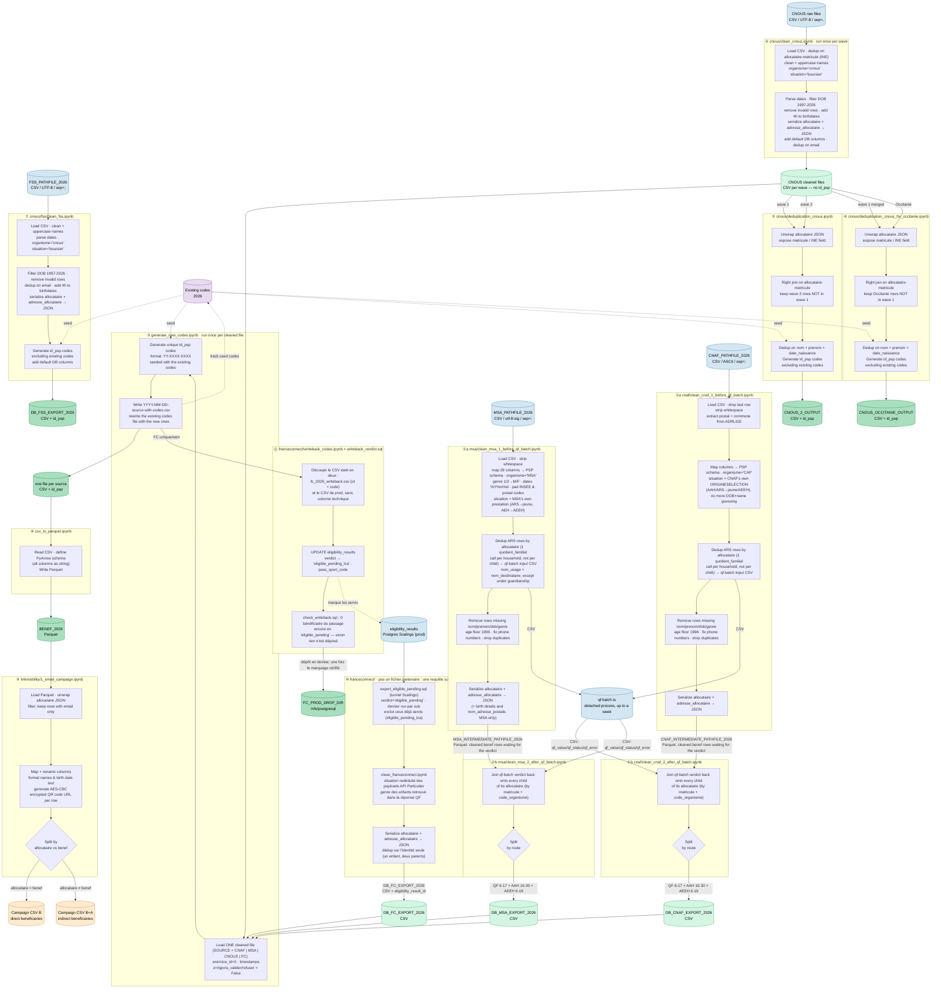

# Data flow

Notebook paths below are relative to [partners/](partners/), except ⑨ which is relative to
this folder. Each partner owns a subfolder holding its notebooks, its extracted library, its
tests and its data files.

What the partners routed through qf-batch have in common — the eligibility windows, the
quotient-familial threshold, the deduplication key, the JSON output schema and the route
selection — lives once in [partners/partners_lib.py](partners/partners_lib.py) (tests in
[partners/test_partners_lib.py](partners/test_partners_lib.py)). A partner's own module only
holds what its file looks like: its raw column names, its date and genre encodings, its
quirks.

Step ③ works the same way: the campaign's default columns and the code generation live in
[partners/generate_codes_lib.py](partners/generate_codes_lib.py), on top of the year-agnostic
drawing and bookkeeping of [utils/codes_utils.py](../utils/codes_utils.py).

Steps ⑩ ③ ⑪ are also driven unattended, by
[partners/franceconnect/run_fc_pipeline.sh](partners/franceconnect/run_fc_pipeline.sh) — the
only source whose input is a live table rather than a frozen export, hence a cron rather than
a one-shot notebook run. It calls the very same functions the notebooks do.

## Running a notebook without a graphical interface

The processing machine is headless, so the notebooks are executed with `nbconvert` rather
than opened. They are **not** converted to `.py`: the business logic already lives in the
tested `*_lib.py` modules, and what remains in the `.ipynb` is the run-by-run reporting —
rejected rows, padded INSEE codes, birth-country labels without a COG match — which
`nbconvert` preserves and a conversion would discard.

```bash
cd data/2026/partners
nb() { ../../.venv/bin/jupyter nbconvert --to notebook --execute --inplace \
         --ExecutePreprocessor.timeout=-1 "$1"; }

nb msa/clean_msa_1_before_qf_batch.ipynb   # ②a writes the qf-batch input + the parquet
systemctl start pass-sport-qf-batch@msa    #    the API batch, detached (up to a week)
nb msa/clean_msa_2_after_qf_batch.ipynb    # ②b joins the verdict, writes DB_MSA_EXPORT_2026
```

`--inplace` makes the executed notebook *be* the run's report, read exactly as if it had run
on screen: `data/.gitignore` does not cover `.ipynb`, so `git diff` shows the counts and
`git checkout` puts the notebook back when you would rather not keep them.
`--ExecutePreprocessor.timeout=-1` lifts the 30 s per-cell default, which would otherwise kill
the read of a several-hundred-thousand-row export. For a report to `scp` back, `--to html` on
the already-executed notebook (so without `--execute`).

Two prerequisites, both handled by [deploy/ansible/](../../deploy/ansible/): the `data/.venv`
virtualenv, and its Jupyter kernel registered under the name `python3` — the name all 13
notebooks declare, without which `nbconvert` fails on `No such kernel named python3`.


