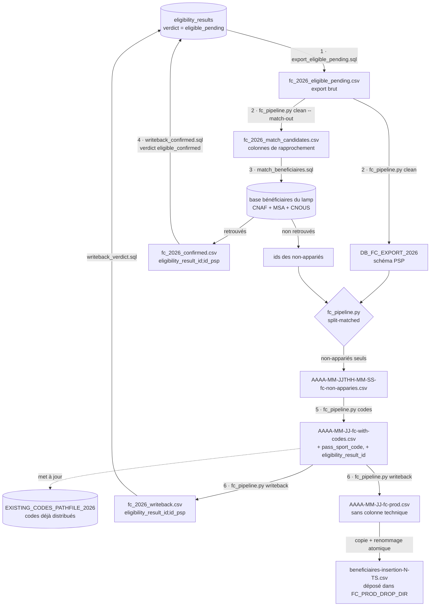

# Source franceconnect — fabriquer des codes pour les `eligible_pending`

Cette source n'est pas un fichier partenaire : c'est une requête sur la table
`eligibility_results` du worker, en production.

Le parcours FranceConnect du site n'écrit plus que deux des verdicts documentés dans
[worker/src/db/schema.ts](../../../../worker/src/db/schema.ts) : `not_eligible` quand aucune
route n'est ouverte, et `eligible_pending` quand les réponses d'API Particulier en ouvrent une.
Ce second-là n'est pas terminal : il désigne quelqu'un que **nos** règles jugent
éligible et à qui aucun code n'a été servi — ce parcours n'interroge plus la base LCA du tout,
son `pass_sport_code` est donc toujours NULL et il n'a reçu que l'accusé de réception de sa
demande. Ce dossier est ce qui transforme cette promesse en code.

## Les 6 étapes, dans cet ordre

| # | Quoi | À la main | En ligne de commande |
|---|------|-----------|----------------------|
| 1 | Extraire les `eligible_pending` de la base | `export_eligible_pending.sql` | idem |
| 2 | Nettoyer vers le schéma PSP | `clean_franceconnect.ipynb` | `fc_pipeline.py clean` |
| 3 | Chercher chacun dans la base bénéficiaires | `match_beneficiaires.sql` | idem |
| 4 | Marquer les **retrouvés** `eligible_confirmed` | `writeback_confirmed.sql` | idem |
| 5 | Fabriquer les codes des **non retrouvés** | `../generate_new_codes.ipynb` avec `SOURCE = 'FC'` | `fc_pipeline.py codes` |
| 6 | Marquer les servis `eligible_confirmed`, code compris, en base | `writeback_codes.ipynb` puis `writeback_verdict.sql` | `fc_pipeline.py writeback` puis les `.sql` |

**L'étape 3 est ce qui remplace l'appel LCA** que ce parcours ne fait plus. Sans elle, une
personne déjà présente dans la base bénéficiaires — parce que la CNAF, la MSA ou le CNOUS
l'ont déclarée — recevrait un second code. Elle doit passer **avant** l'étape 5 : un code
tiré est comptabilisé dans `EXISTING_CODES_PATHFILE_2026` et ne se reprend pas.

⚠️ **Deux bases, à ne pas confondre.** Les étapes 1, 4 et 6 visent la base du site, sur
Scalingo, à travers un tunnel. L'étape 3 vise la base bénéficiaires locale du lamp
([lamp01/](../../../../lamp01/)), en direct.



### Comment le rapprochement identifie quelqu'un

**Une stratégie par (situation, caisse)**, choisie par la `situation` et l'`organisme` du
candidat (résolus par `clean_fc_lib`), et qui ne cherche que les lignes de base portant cette
même situation et cette même caisse (plus `exercice_id` et un `id_psp` non nul). Le verdict
est **strict** : un candidat est apparié ssi sa stratégie retourne **exactement un** `id_psp`
distinct. Zéro ou plusieurs = non apparié → code neuf, le comportement le moins risqué des
deux. Aucun départageur.

| stratégie | allocataire | bénéficiaire |
|---|---|---|
| **boursier** | `allocataire_matricule` = INE, exact — le CNOUS y range l'INE du boursier ; rien d'équivalent CNAF/MSA | — |
| **AAH MSA** | — | nom de **naissance** (`family_name`) · prénoms ⊆ · genre · naissance |
| **AAH CAF** | — | nom d'**usage** (`preferred_username`, seul disponible : la route AAH n'appelle pas QF) · prénoms ⊆ · genre · naissance |
| **AEEH MSA** | nom de naissance · prénoms ⊆ · qualité (M/Mme) · naissance | nom · prénoms stricts · genre · naissance |
| **AEEH CAF** | nom d'usage (`RESPDOS`) · prénoms ⊆ · qualité · *pas* de naissance (la CNAF ne la sérialise pas) | nom (`NOMENF`, accepté sous ses deux formes candidat) · prénoms stricts · genre · naissance |
| **jeune MSA** | nom de naissance · prénoms ⊆ · qualité · naissance | nom · prénoms ⊆ · genre · naissance |
| **jeune CAF** | nom de **naissance**, genre et naissance depuis `beneficiaire_cnaf_extra_field` (rempli pour l'origine ARS, la population QF) · prénoms ⊆ | nom (deux formes) · prénoms ⊆ · genre · naissance |

**⊆ — le containment des prénoms** : les prénoms venus de la base LAMP doivent être
**contenus** dans les prénoms FranceConnect — sous-ensemble de mots, ordre libre, après
normalisation des deux côtés. La CNAF ne stocke qu'un prénom (`PRENOMDOS`, `NOMENF`),
FranceConnect les porte tous.

**AAH, cas particulier** : la caisse est indéterminable depuis l'API (aucun appel
`quotient_familial` sur cette route), les **deux** stratégies sont donc essayées. Concluant
ssi exactement une des deux retourne exactement une ligne et l'autre aucune — deux stratégies
à une ligne, même identique, restent inconcluantes.

Côté candidat, les noms viennent de la réponse `quotient_familial` d'abord (le vocabulaire
même de la caisse), du pivot FranceConnect en repli : nom de naissance =
`qf_allocataires[].nom_naissance` à défaut `family_name`, nom d'usage =
`qf_allocataires[].nom_usage` à défaut `preferred_username`. Pour un enfant, l'usage est
celui que le worker stocke dans `enfant_identite`, à défaut `qf_enfants[].nom_usage` ; sur
une ligne `self`, c'est celui de l'allocataire.

`fc_2026_eligible_pending.csv` et `DB_FC_EXPORT_2026` sont réécrits à chaque passage ; les
fichiers horodatés (`AAAA-MM-JJ-fc-with-codes.csv`, `fc_2026_writeback.csv`,
`AAAA-MM-JJ-fc-prod.csv`, le fichier déposé) sont propres à un passage et ne sont jamais
réécrits. `EXISTING_CODES_PATHFILE_2026` seul survit à travers les passages : c'est la
mémoire des codes déjà distribués, toutes sources confondues.

Les notebooks et la ligne de commande appellent les **mêmes fonctions**, dans
[fc_pipeline.py](fc_pipeline.py) : passer à la main et passer automatiquement ne peuvent pas
diverger. Les notebooks gardent leur intérêt pour regarder les comptes d'un passage et
reprendre une étape isolément.

**L'étape 4 n'est pas optionnelle.** La génération de codes déduplique les *codes*, jamais
les *personnes* : sans elle, le prochain passage réextrairait les mêmes bénéficiaires et leur
fabriquerait un second code. C'est elle qui bascule les lignes traitées en
`eligible_confirmed` avec leur code, que l'étape 1 exclut ensuite. La question ne se pose pas pour les fichiers partenaires, qui sont des
exports figés ; ici la table continue de vivre entre deux passages.

## Passage automatique — la cron

[run_fc_pipeline.sh](run_fc_pipeline.sh) enchaîne les 4 étapes sans interaction : il ouvre et
referme lui-même le tunnel Scalingo, et dépose le CSV final dans `FC_PROD_DROP_DIR`
(`/nfs/run` par défaut), d'où il est injecté en base de production. Il finit en posant le job
`fc_code_emails` du worker, qui envoie leur code par courriel — voir
[Après le write-back](#après-le-write-back).

L'entrée de crontab n'est plus posée à la main : elle l'est par
[deploy/ansible/lamp-setup.yml](../../../../deploy/ansible/lamp-setup.yml), qui la nomme
`pass-sport-fc` — rejouer le playbook ne la duplique donc pas.

```crontab
30 0,6,12,18 * * * /chemin/vers/data/2026/partners/franceconnect/run_fc_pipeline.sh
```

⚠️ **Elle est posée désactivée (commentée) par défaut.** Le passage dépose un CSV en
production et marque `eligibility_results` : il ne part seul qu'une fois l'empreinte SSH
Scalingo amorcée à la main et un essai à blanc validé (`FC_PROD_DROP_DIR=/tmp/fc-drop`). Pour
l'activer, rejouer le playbook avec `--extra-vars pass_sport_fc_cron_enabled=true` — voir
[deploy/ansible/README.md](../../../../deploy/ansible/README.md).

Ce que le script garantit, et qu'un passage à la main doit respecter aussi :

- **le dépôt vient en dernier.** Le CSV ne part vers `FC_PROD_DROP_DIR` qu'une fois la base
  marquée *et* le marquage vérifié par `check_writeback.sql`. Un fichier déposé sans marquage
  ferait fabriquer un second code aux mêmes personnes au passage suivant ;
- **un seul passage à la fois** — un verrou `flock` fait renoncer un passage qui en
  chevaucherait un autre, pour la même raison ;
- **rien à traiter n'est pas une erreur** : si l'export ne rend qu'un en-tête, le script sort
  en 0 sans rien déposer. C'est le cas nominal d'une cron plus fréquente que les
  resoumissions, et c'est aussi la preuve que le passage précédent a bien refermé la boucle ;
- **le job courriel est posé à chaque sortie réussie**, même sans nouveau bénéficiaire : il
  retente les courriels échoués et sert les appariés d'un passage précédent. Il ne l'est ni
  sur une erreur ni quand le verrou est déjà pris — le passage suivant s'en charge.

Les fichiers que la cron produit sont horodatés à la seconde
(`AAAA-MM-JJTHH-MM-SS-fc-with-codes.csv`, et le `-prod.csv` qui en dérive), là où les notebooks
s'en tiennent au jour : une cron peut passer plusieurs fois par jour, et deux passages
écraseraient sinon le fichier du précédent — y compris dans `FC_PROD_DROP_DIR`, où il n'a
peut-être pas encore été injecté.

Le journal du jour est écrit dans `FC_LOG_DIR` (`logs/` de ce dossier par défaut) ; toute
sortie non nulle est une anomalie, que cron enverra par courriel. En cas d'échec après
l'étape 3, les fichiers intermédiaires sont restés en place : reprendre à la main à partir de
`writeback_codes.ipynb` avec le `*-fc-with-codes.csv` le plus récent, **sans jamais rejouer
l'étape 3** — les codes sont déjà fabriqués et comptabilisés dans
`EXISTING_CODES_PATHFILE_2026`, y compris lorsque le passage a échoué après les avoir tirés.

La machine doit porter : `psql`, un `scalingo` authentifié sans interaction
(`SCALINGO_API_TOKEN`) avec une clé SSH sans phrase de passe, et le virtualenv `data/.venv`.

`db-tunnel` monte sa propre connexion SSH, indépendante de l'authentification `scalingo` :
`scalingo login --ssh-identity` ne configure que la poignée de main de login, pas `db-tunnel`.
Sans indication, `db-tunnel` retombe sur l'agent SSH puis sur `~/.ssh/id_rsa`. Si la clé à
utiliser porte un autre nom, soit passer `-i`/`--identity` à la main (voir ci-dessous), soit
renseigner `SCALINGO_SSH_IDENTITY` dans `data/.env` ou `/etc/default/pass-sport-fc` pour que
`run_fc_pipeline.sh` la reprenne automatiquement.

## Étape 1 — extraction

Ouvrir le tunnel Scalingo dans un terminal dédié, et le laisser tourner :

```bash
scalingo --app "$SCALINGO_APP" db-tunnel SCALINGO_POSTGRESQL_URL
# Si la clé n'est ni dans l'agent SSH ni ~/.ssh/id_rsa, ajouter -i ~/.ssh/<la-clé> :
# scalingo --app "$SCALINGO_APP" db-tunnel -i ~/.ssh/<la-clé> SCALINGO_POSTGRESQL_URL
# -> Tunnel ouvert, port local 10000
```

Dans un autre terminal, depuis ce dossier :

```bash
cd data/2026/partners/franceconnect

# L'URL de la base, hôte et port remplacés par ceux du tunnel :
scalingo --app "$SCALINGO_APP" env-get SCALINGO_POSTGRESQL_URL
export FC_DATABASE_URL="postgres://<user>:<pwd>@127.0.0.1:10000/<db>?sslmode=disable"

psql "$FC_DATABASE_URL" -f export_eligible_pending.sql
# -> fc_2026_eligible_pending.csv, ou -v out=<chemin> pour choisir la destination
```

Le CSV produit contient des données personnelles (identités pivot, courriels) : il est
couvert par le `*.csv` de [data/.gitignore](../../../.gitignore) et n'a rien à faire ailleurs
que sur le poste qui traite la campagne.

Contrôle utile avant de lancer la suite — le compte doit correspondre, aux resoumissions
près :

```sql
select count(*) from eligibility_results where verdict = 'eligible_pending';
```

## Étape 2 — nettoyage

`clean_franceconnect.ipynb` reconstruit ce que la table ne mémorise pas, puis écrit
`DB_FC_EXPORT_2026` au schéma de production. Trois manques sont comblés là :

- **la situation** — `eligibility_results` ne retient que `source` (self/enfant) et un
  booléen d'éligibilité, jamais quelle aide a ouvert le droit. Elle se redéduit des réponses
  brutes d'API Particulier, conservées dans `eligibility_history.response_payload`, en rejouant les
  règles de [candidates.ts](../../../../worker/src/eligibility/candidates.ts) ;
- **le genre des enfants** — `enfant_identite` ne porte que nom, prénom et date de naissance ;
  le sexe est retrouvé par appariement dans le tableau `enfants` de la réponse quotient
  familial ;
- **le schéma PSP** — l'identité arrive au vocabulaire FranceConnect, répartie sur deux
  colonnes JSON selon `source`. `adresse_allocataire` y vaut `{}` : le parcours ne demande plus
  la commune de résidence depuis que LCA en est débranché, et FranceConnect n'a jamais fourni
  d'adresse postale. Rien ne rend ce champ obligatoire — les colonnes requises sont
  `nom, prenom, date_naissance, genre` (`partners_lib.NECESSARY_COLUMNS`) plus `situation`.

Ces règles vivent dans `clean_fc_lib.py` ; leur enchaînement, dans `fc_pipeline.clean` :

```bash
source data/.venv/bin/activate
pytest 2026/partners/franceconnect/test_clean_fc_lib.py 2026/partners/franceconnect/test_fc_pipeline.py

# ou, sans notebook :
python 2026/partners/franceconnect/fc_pipeline.py clean
```

La fenêtre AEEH de cette source est celle de `partners_lib` (6-19 ans) : le worker interroge
l'AEEH pour chaque enfant de cette tranche que le quotient familial ne couvre pas déjà. C'est
ce `& ~jeune` qui reste la seule différence avec le fichier partenaire, où la CNAF déclare
elle-même l'AEEH sans regarder le quotient.

## Étape 3 — génération des codes

`../generate_new_codes.ipynb`, avec `SOURCE = 'FC'` dans la cellule de configuration. Rien
d'autre à y changer — ou `python fc_pipeline.py codes`, qui appelle la même fonction. Il
produit `AAAA-MM-JJ-fc-with-codes.csv` à côté de `DB_FC_EXPORT_2026`, et met à jour
`EXISTING_CODES_PATHFILE_2026`.

Ce fichier porte une colonne de plus que les fichiers partenaires :
`eligibility_result_id`, l'identifiant de la ligne d'origine en base. C'est la clé du
write-back, et l'étape 4 la retire avant l'injection en production.

## Étape 4 — write-back

`writeback_codes.ipynb` — ou `python fc_pipeline.py writeback` — découpe le fichier daté en
deux :

- `fc_2026_writeback.csv` — deux colonnes `eligibility_result_id;id_psp`, dans ce dossier ;
- `AAAA-MM-JJ-fc-prod.csv` — le CSV final sans la colonne technique, prêt pour l'injection en
  base de production.

Puis, tunnel ouvert, **depuis ce dossier** :

```bash
cd data/2026/partners/franceconnect
psql "$FC_DATABASE_URL" -f writeback_verdict.sql
psql "$FC_DATABASE_URL" -At -f check_writeback.sql   # doit afficher 0
```

Le nom `fc_2026_writeback.csv` est figé et le `cd` obligatoire : `\copy` est la seule commande
psql qui n'interpole aucune variable dans ses arguments, le chemin ne peut donc pas lui être
passé, et comme elle s'exécute côté client il est relatif au dossier d'où psql est lancé.

`writeback_verdict.sql` écrit deux tables dans la même transaction : le verdict et le code dans
`eligibility_results`, et une ligne `actor = 'cron'`, `action = 'psp.code_writeback'` dans
`eligibility_history` — la fabrication d'un code est la seule action du parcours qui ne passe
pas par le worker, et n'aurait sinon aucune trace.

Il affiche quatre comptes : `lignes_csv`, `lignes_marquees` et `lignes_historisees` doivent
être égaux, et `ids_introuvables` valoir 0. Il est idempotent — rejoué, il affiche `UPDATE 0`,
le filtre `verdict = 'eligible_pending'` empêchant de re-marquer une ligne ou d'écraser un code
déjà confirmé.

`check_writeback.sql` rend une seule valeur, celle sur laquelle la cron s'arrête : combien des
bénéficiaires de ce passage sont **encore** en `eligible_pending` ou sans ligne d'historique.
Ce doit être 0. Le CSV de production ne part en injection qu'une fois ce contrôle passé.

**Contrôle final** : relancer `export_eligible_pending.sql`. Le CSV doit être vide, en-tête
seul — à ceci près que le site continue de tourner, et qu'une resoumission survenue
entre-temps y apparaîtra légitimement. C'est pour cela que la cron s'appuie sur
`check_writeback.sql`, qui ne regarde que les ids du passage, et non sur ce contrôle-ci.

## Variables d'environnement

À ajouter dans `data/.env` (elles ne sont pas dans `.env.example`, qui n'est pas versionné
ici) :

```bash
# Sortie brute de export_eligible_pending.sql
FC_EXPORT_PATHFILE_2026="./2026/partners/franceconnect/fc_2026_eligible_pending.csv"
# CSV nettoyé au schéma PSP, écrit par clean_franceconnect.ipynb
DB_FC_EXPORT_2026="./2026/partners/franceconnect/FC_2026.csv"
# Fichier daté produit par generate_new_codes.ipynb, relu par writeback_codes.ipynb.
# Seuls les notebooks le lisent : la cron recalcule ce chemin à chaque passage, il n'y a donc
# plus de date à éditer à la main entre deux étapes.
FC_WITH_CODES_PATHFILE_2026="./2026/partners/franceconnect/AAAA-MM-JJ-fc-with-codes.csv"
```

Ce dont la cron a besoin en plus. `SCALINGO_APP` et le jeton se mettent plutôt dans
`/etc/default/pass-sport-fc`, que le script lit aussi : ils appartiennent à la machine, pas
au dépôt. Les valeurs déjà présentes dans l'environnement l'emportent sur ces deux fichiers,
ce qui permet un passage d'essai avec un dossier de dépôt détourné —
`FC_PROD_DROP_DIR=/tmp/fc-drop ./run_fc_pipeline.sh`.

```bash
SCALINGO_APP="<application hébergeant la base>"   # obligatoire
SCALINGO_API_TOKEN="<jeton>"                      # pour un scalingo non interactif
FC_PROD_DROP_DIR="/nfs/run"                       # où le CSV final est déposé
FC_TUNNEL_PORT="10000"                            # port local du tunnel Postgres
FC_REDIS_TUNNEL_PORT="10001"                      # port local du tunnel Redis (job courriel)
FC_CODE_EMAILS_DRY_RUN="1"                        # essai : job courriel posé en dry-run
FC_LOG_DIR="./2026/partners/franceconnect/logs"   # journaux, un par jour
FC_LOCK_FILE="/tmp/pass-sport-fc.lock"            # verrou anti-chevauchement
```

## Après le write-back

Les deux write-backs posent `eligible_confirmed` et le code : le site affiche celui-ci tout de
suite, et l'attestation PDF est servie. Seule l'action d'historique distingue un code
**fabriqué** (`psp.code_writeback`, étape 6) d'un code **retrouvé** (`psp.code_match_base`,
étape 4).

L'envoi par courriel n'est pas dans ce dossier : c'est le job `fc_code_emails` du worker
([worker/src/jobs/fc-code-emails.ts](../../../../worker/src/jobs/fc-code-emails.ts)), que
`run_fc_pipeline.sh` pose sur sa queue en fin de passage, à travers un second tunnel, vers le
Redis de Scalingo. Il ramasse toute ligne FranceConnect à `eligible_confirmed` portant un code
et pas encore d'`email_kind`, sans distinguer les deux issues du rapprochement.

Le template dépend de l'aide, que la colonne `situation` retient désormais — le worker l'écrit à
l'insert, ce qui rend à terme `clean_fc_lib.resolve_situation` inutile. Les lignes antérieures à
cette colonne n'en portent pas : celles de `source = 'enfant'` s'en passent (QF et AEEH mènent au
même courriel), celles de `source = 'self'` sont laissées de côté avec une alerte Sentry plutôt que
de partir sur le mauvais texte.
